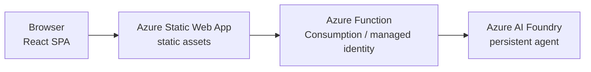
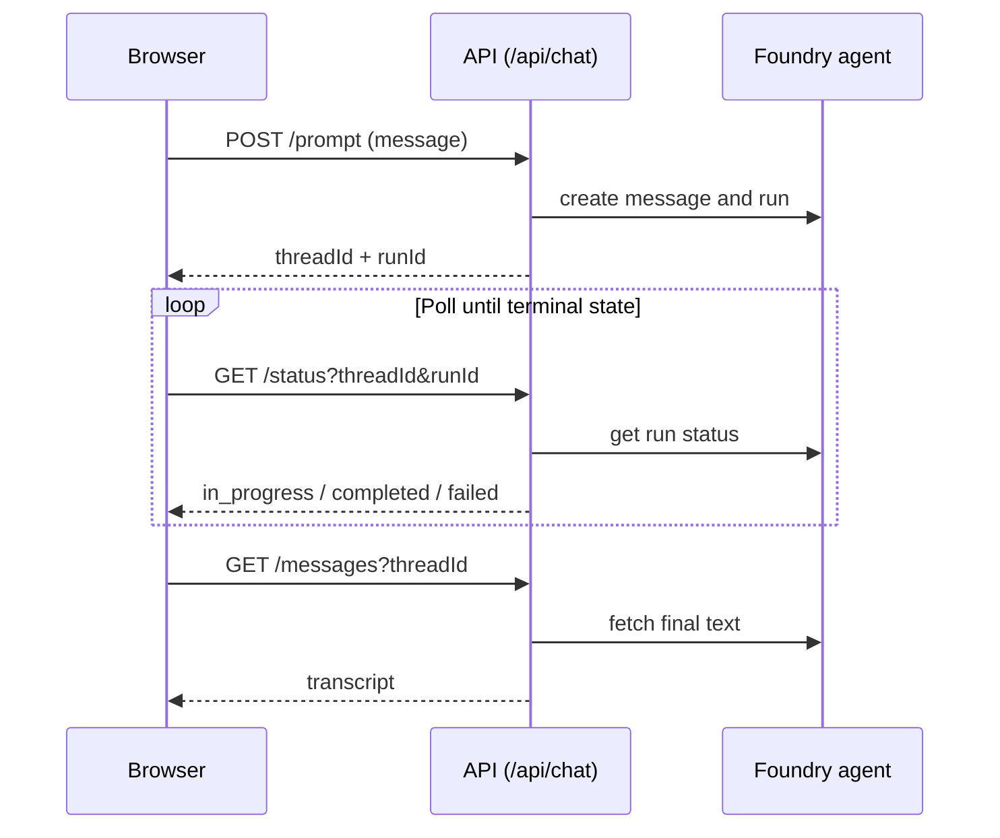

# Technical Design: Low-Cost Chat UI for Azure AI Foundry

A serverless, white-label chat UI that puts an Azure AI Foundry agent in front of users
at **near-zero hosting cost**. One codebase deploys to two cost tiers: a **$0 test**
environment and a lean **production** environment.

---

## 1. Goals & Non-Goals

**Goals**
- Cheapest possible hosting for a Foundry agent chat UI.
- Same code, two environments: **test** (free) and **production** (lean, pay-per-use).
- Keyless: authenticate to Foundry with a managed identity — no secrets in the browser.
- Works immediately after provisioning; deploy with one command.

**Non-Goals**
- No always-on compute, no dedicated servers, no container orchestration.
- No on-prem / agent-to-agent bridging — the UI talks directly to a Foundry agent.

---

## 2. Architecture



- **Frontend** — React + Vite, compiled to static HTML/JS/CSS. Hosted on Static Web Apps.
- **API** — Azure Functions (Consumption). Creates threads/runs and polls the agent.
  Authenticates to Foundry with a **system-assigned managed identity** (no keys).
- **Foundry** — the customer's existing persistent agent.

The API uses an **asynchronous poll pattern** (dispatch -> poll status -> fetch messages)
so it never holds a long-lived connection and stays within the SWA gateway timeout.



---

## 3. Cost Tiers

| Concern            | Test environment                  | Production environment                |
| ------------------ | --------------------------------- | ------------------------------------- |
| Static Web App     | **Free** tier ($0)                | **Standard** tier                     |
| API wiring         | Function called directly via CORS | Function **linked** as `/api` backend |
| Function App       | Consumption (Y1)                  | Consumption (Y1)                      |
| Base cost          | **$0**                            | ~$9/mo SWA + pay-per-execution        |
| Custom domains/SLA | No                                | Yes                                   |

Why the split: the SWA **Free** tier does not support linked backends, so in **test** the
static frontend calls the Function App's public URL directly (CORS is open). In
**production**, the **Standard** tier links the Function App so everything is served from
one origin under `/api/*`. Both tiers keep the Function App on Consumption, whose first
1M executions per month are free.

---

## 4. Components

### 4.1 Frontend (`src/`)
- React 19 / TypeScript / Vite -> static assets.
- Reads `VITE_API_BASE` at build time: empty for production (same-origin `/api`), or the
  Function App URL for the test tier.
- Cyber-styled terminal chat UI.

### 4.2 API (`api/`)
- Azure Functions (Node) with three routes:
  - `POST /api/chat/prompt` — create/reuse thread, post message, start run.
  - `GET  /api/chat/status` — poll run status.
  - `GET  /api/chat/messages` — fetch the final transcript.
- `DefaultAzureCredential` -> managed identity in Azure. The agent id is resolved once at
  provision time (`AZURE_AI_AGENT_ID`) to avoid per-instance lookups.

### 4.3 Infrastructure (`infra/main.bicep`)
- Parameter `environmentType` = `test` | `production` switches:
  - SWA SKU (`Free` vs `Standard`).
  - Whether a linked backend is created (Standard only).
- Always provisions: Storage, Application Insights, Consumption plan, Function App
  (system-assigned identity), Static Web App.

---

## 5. Provisioning

One command provisions and deploys everything:

```powershell
./scripts/provision.ps1 `
    -SubscriptionId "<sub>" `
    -ResourceGroup "rg-xiaocao" `
    -FoundryAgentName "<agent>" `
    -FoundryEndpoint "https://<account>.services.ai.azure.com/api/projects/<project>" `
    -FoundryResourceId "/subscriptions/<sub>/resourceGroups/<rg>/providers/Microsoft.CognitiveServices/accounts/<account>" `
    -EnvironmentType test   # or: production
```

The script:
1. Deploys the Bicep template for the chosen tier.
2. Grants the Function App identity **Azure AI Developer** on the Foundry account and project.
3. Resolves the agent id and stores it as `AZURE_AI_AGENT_ID`.
4. Builds and deploys the Function App and the Static Web App.

> `FoundryResourceId` must be the bare ARM resource id (not a portal URL). Get it with:
> `az cognitiveservices account show -n <account> -g <rg> --query id -o tsv`

---

## 6. Security
- No secrets in the browser; the API calls Foundry via managed identity.
- Scoped role assignments granted at provision time (account + project scope).
- HTTPS-only, TLS 1.2 minimum, storage public access disabled.

---

## 7. CI/CD
`.github/workflows/azure-static-web-apps.yml` builds the frontend and deploys to SWA on
push to `main`. The Function App is deployed by the provisioning script.
